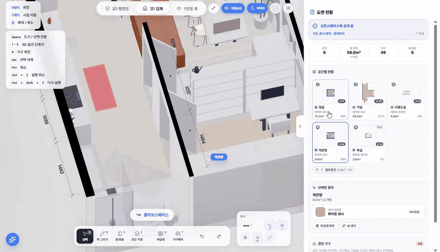

### 콜라보스페이스를 만들고 있어요.

[**콜라보스페이스**](https://collabospace.com)는 '나이, 배경, 소득 수준에 관계없이 누구나 좋은 공간을 발견하고, 스스로 만들 수 있도록' 이라는 미션을 가진 브랜드예요.

> Building a future where anyone—regardless of age, background, or income—can discover good spaces and create one of their own.

  <a href="https://collabospace.com/openspace/"><strong>오픈스페이스 직접 둘러보기 →</strong></a>

[웹](https://collabospace.com) · [App Store](https://apps.apple.com/app/id6775731858) · [Google Play](https://play.google.com/store/apps/details?id=com.collabospace.app)

---

**지금 만들고 있는 것**

현재는 “검색해서 제품을 고르는 방식”에서 “AI가 내 공간을 이해하고 함께 선택해주는 방식”으로 홈퍼니싱의 구매 경험을 바꾸는 것에 집중하고 있어요.

자신의 공간을 3D로 만들고, 발견한 취향을 실제 공간으로 이어갈 수 있는 경험을 설계해요.

**공개해 둔 것**

- [**CollaboSpace**](https://github.com/swinggto-droid/CollaboSpace) — 제품 소개, 공개 기술 문서와 개발 기록
- [**ShotToAI**](https://github.com/swinggto-droid/ShotToAI) — 모니터를 골라 AI 코딩 도구에 바로 붙여넣는 윈도우 유틸리티 · MIT
- [**interior-trend**](https://github.com/swinggto-droid/interior-trend) — 유튜브·인스타그램·틱톡·X·스레드에서 인테리어 키워드를 모으는 수집기

**쓴 글**

- [Supabase 인증에서 조용히 실패하는 세 가지](https://github.com/swinggto-droid/CollaboSpace/blob/main/docs/notes/supabase-auth-pitfalls.md)

**주로 쓰는 것**

`Next.js` `React` `TypeScript` `Supabase` `Flutter` `three.js`

**함께 이야기하고 싶다면**

Space · 3D · Commerce · Creators  
[swhong@collabospace.com](mailto:swhong@collabospace.com)

---

잔디의 대부분은 비공개 저장소예요 — 콜라보스페이스 제품 코드요.